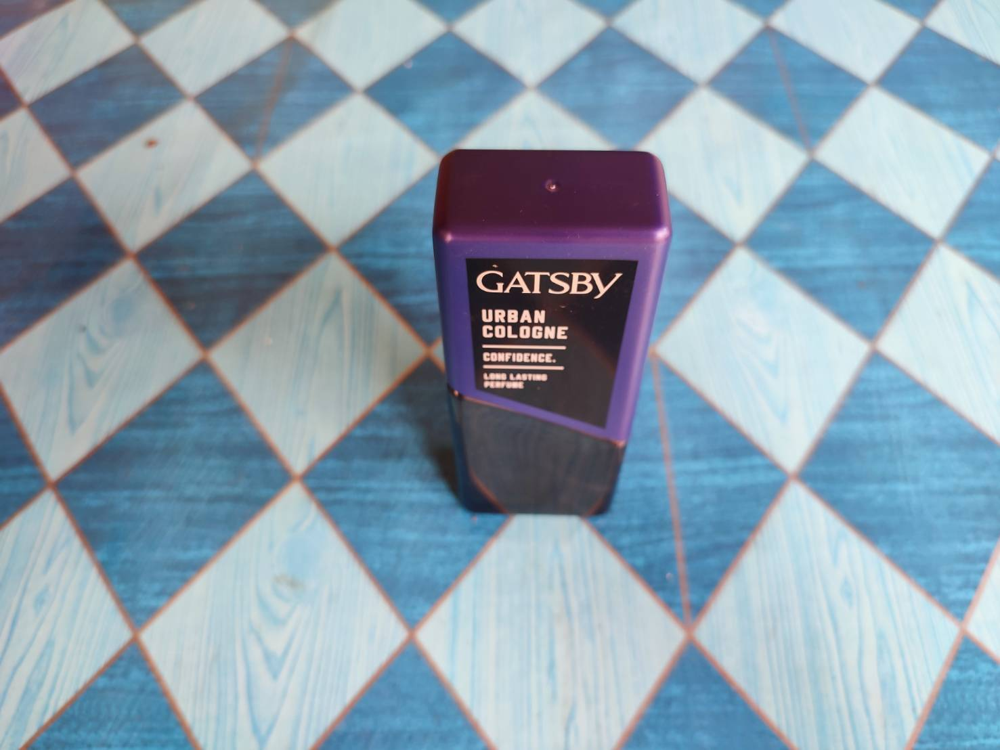
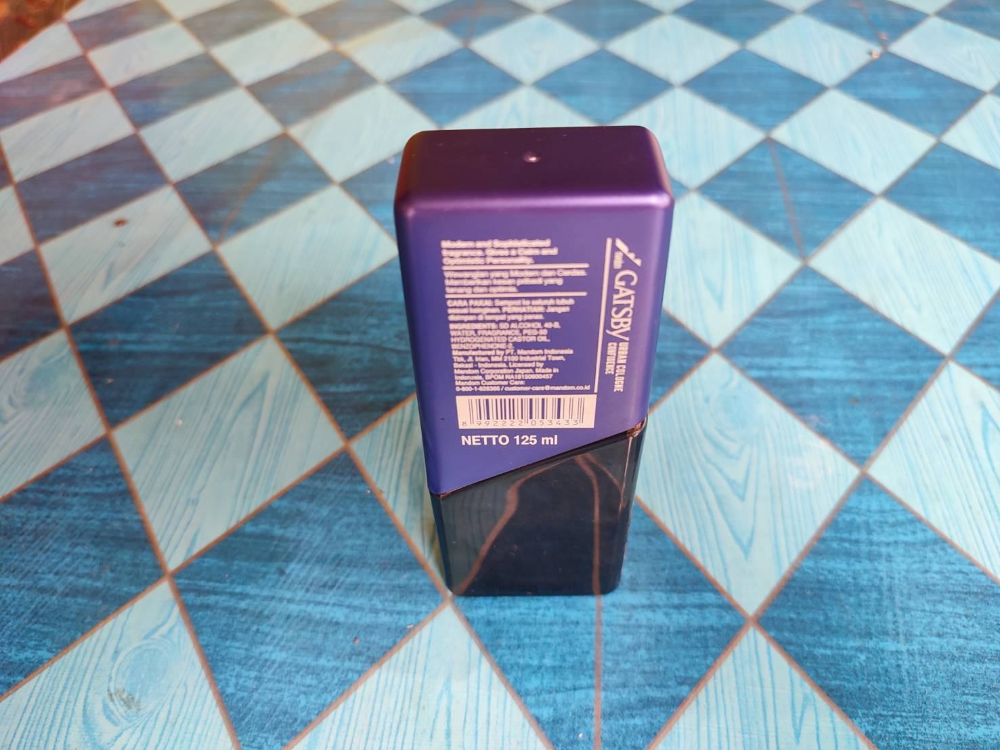
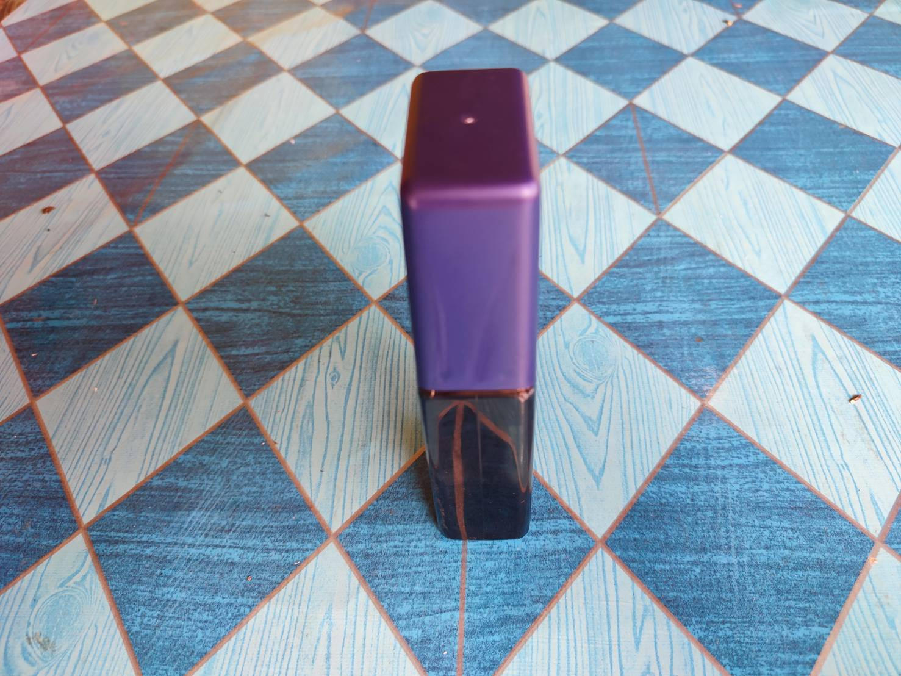
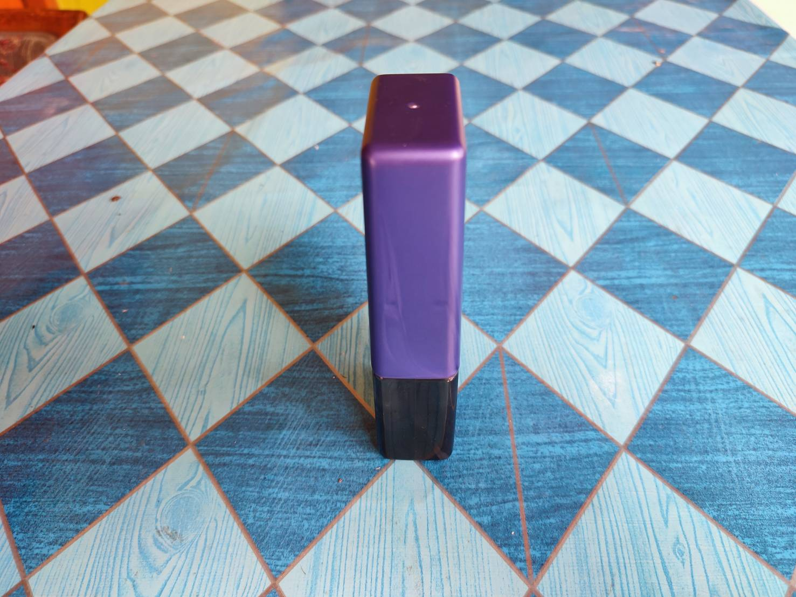
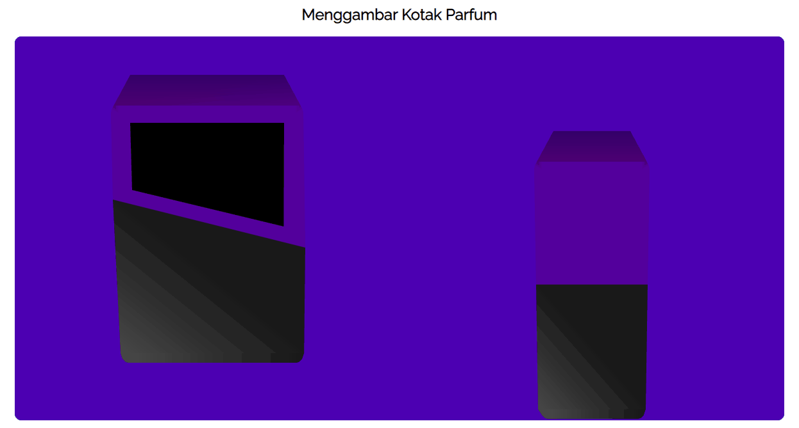

# Tugas 1

Link tugas Threejs: https://cg2021a.github.io/tugas-1-mirzaq19/Threejs/

### Nama benda yang saya pilih: **Kotak Parfum**

## Tampak Depan Atas

## Tampak Belakang Atas

## Tampak Kiri Atas

## Tampak Kanan Atas

## Hasil Jadi

Foto yang dipakai dalam pembuatan object dengan webgl adalah foto kotak parfum untuk tampak depan dan kiri. Kecepatan animasi sesuai dengan NRP yaitu **0.0065**. Hasil jadinya dapat dilihat pada gambar di bawah ini atau dengan mengakses tautan berikut https://cg2021a.github.io/tugas-1-mirzaq19/gambar-barang/

